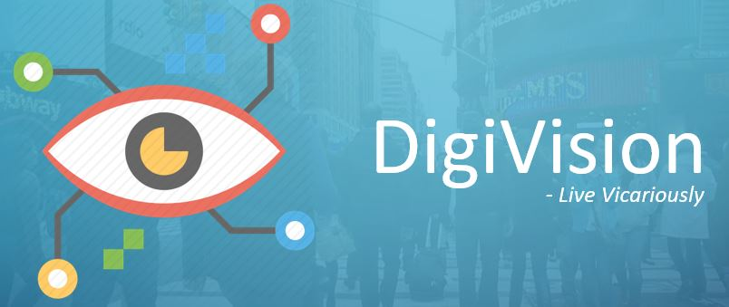
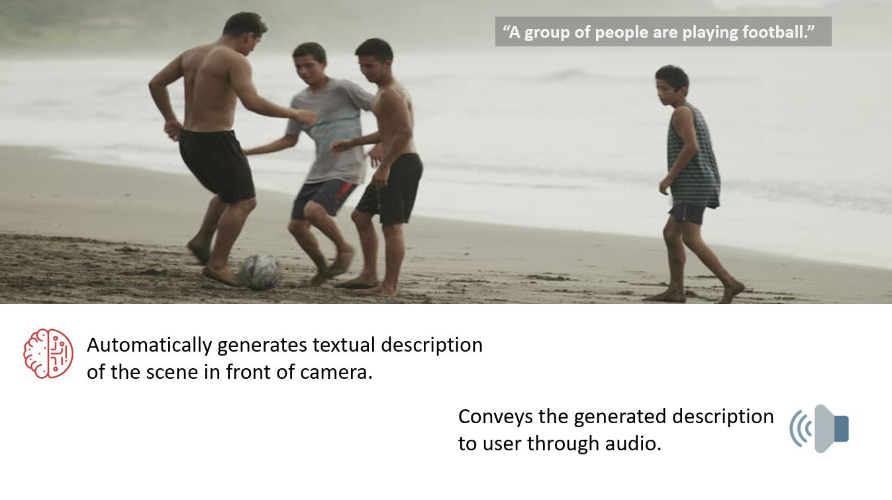
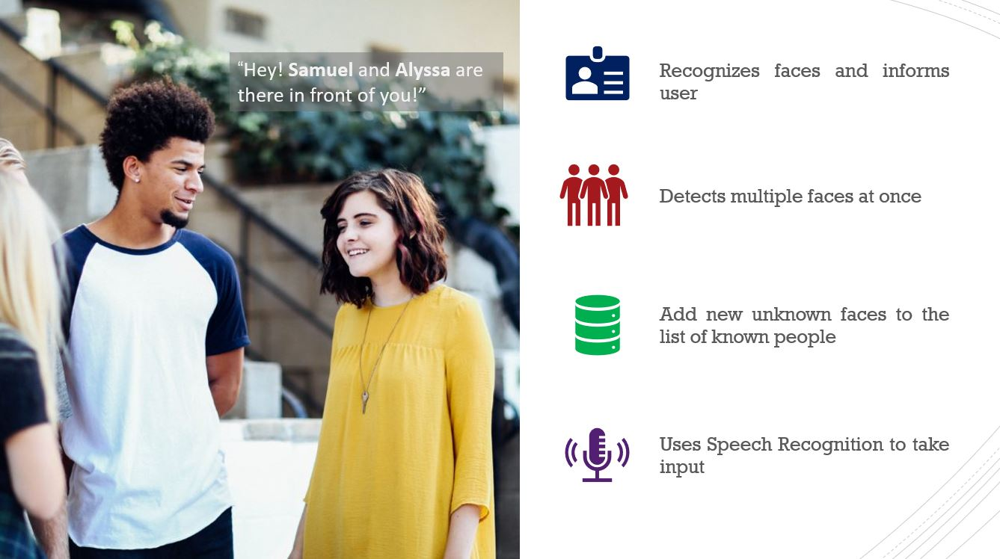

# DigiVision
A deep learning based application which is entitled to help the visually impaired people. The application automatically generates the textual description of what's happening in front of the camera and conveys it to person through audio. It is capable of recognising faces and tell the user whether a known person is standing in front of him or not.




# Requirements
* Tensorflow (>1.9)
* Keras
* OpenCV
* Python 3.5+
* gTTS
* pygame
* pymongo

# Dataset used
MS COCO 2017 for Image Processing and Captioning.

Dataset for face Recognition is manually collected.

# Features




# Setup
- Install all the required frameworks, libraries and dependecies as mentioned in Requirements above.
- Download the COCO dataset if not available, in order to train the model
  - [Train images](http://images.cocodataset.org/zips/train2017.zip)
  - [Test images](http://images.cocodataset.org/zips/test2017.zip)
  - [Annotations](http://images.cocodataset.org/annotations/annotations_trainval2017.zip)
 
  Or run:
 ```
 python download.py
 ```
- Create your own MongoDB Cluster and replace MONGO_URI in line 16 of f_part.py with your own Mongo AccessID.
- Run the project using:
  - MAIN_RUN.py (for gTTS audio and dding names through Canvas/ python gtk)
  - digivision.py (for Single face detection along with new face addition through python gtk)
  - digivision2.py (for Multiface detection along with all Input/Outputs through Audio)
  
 ```
 python <desired_file_name>.py
 ```
 - It will take around 90 minutes to process all images and approx 5 minutes to process Validation images.
 - Takes around 22 minutes for a single epoch during training on batch size of 256 on NVIDIA GTX 960M.
 - Don't need to re-train data on every single run. Once trained, weights gets loaded automatically.
 
 # Demo
 [Click here for demo for MAIN_RUN.py](d2.mp4)
